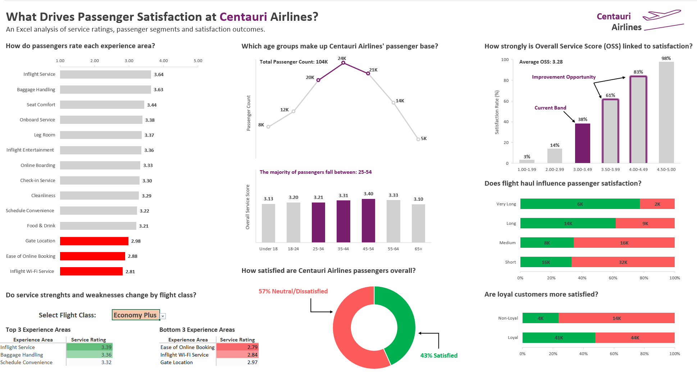

# Centauri Airlines Passenger Satisfaction Dashboard

## Project Overview

This project analyses airline passenger satisfaction data to understand which service areas, passenger segments, and journey factors are associated with overall satisfaction.

The dashboard was built in microsoft excel using functions and formulas focusing on service ratings, passenger experience areas, flight class, age groups, customer loyalty, and overall satisfaction outcomes.

The aim of the project was to identify where Centauri Airlines should focus improvement efforts to increase passenger satisfaction.

---

## Business Question

**What drives passenger satisfaction at Centauri Airlines?**

Supporting questions explored in the dashboard:

- Which passenger experience areas receive the highest and lowest service ratings?
- Do service strengths and weaknesses vary by flight class?
- Which age groups make up the main passenger base?
- How do different age groups rate us?
- How satisfied are passengers overall?
- How strongly is Overall Service Score (OSS) linked to satisfaction?
- Does satisfaction vary by flight class?
- Does loyalty result in satisfaction?

---

## Excel Techniques Used

This project used a formula-driven approach to build the dashboard and support analysis.

Key Excel techniques included:

- `COUNTIF` and `COUNTIFS`
- `AVERAGEIF` and `AVERAGEIFS`
- `SUMIF` and `SUMIFS`
- `IF` and `IFS`
- Ranking formulas - `RANK.EQ`
- Lookup formulas - `XLOOKUP`
- Dynamic Array Functions - `Transpose` , `Unique`, `Sort`
- Data validation dropdowns - ability to choose different flight class.
- Conditional formatting - colour scales for service ratings.
- Fill Series.
- Helper columns - Age bands, Overall Service Score bands, Flight haul bands, Delay bands etc.
- Visualisation techniques 
- Donut charts
- Bar charts
- Line chart
- 100% stacked bar charts
- Dynamic tables 
- Custom number formatting
- Dashboard layout and visual storytelling
- Dashboard Protection
   
---

## Data Preparation and Assumptions

Several helper columns were created to support the analysis:

- **Overall Service Score**: calculated as the average rating across passenger experience areas. Overall Service Score calculation example: There are 14 categories. A passenger rates us: 2,4,4,2,5,1,4,0,3,3,2,3,5,3. Sum of the rating = 41. Number of response = 13. Overall Service Score = 41/13 = 3.15.
- **Age Group**: passengers were grouped into age bands.
- **Flight Haul Band**: flight distance was grouped into short, medium, long, and very long-haul categories.
- **Delay Band**: flights were grouped according to no delay, minor, moderate and severe delay.
- **Overall Service Score Band**: passengers were grouped based on their overall service score.
- **Satisfaction Flag**: used to calculate satisfaction rates. 1 = Satisfied. 0 = Neutral/Dissatisfied.

Important assumptions:

- Rating values of `0` were treated as **Not Rated / Not Applicable** and excluded from service rating calculations. This is what the inital author of the data assumes. Nonetheless, these responses were low/negligible in relation to the overall data.
- Flight distance was treated as miles.
- The analysis focuses on association rather than causation. For example, higher satisfaction on longer-haul flights may be influenced by class mix rather than flight haul alone.

Other information:

- Initial data was very clean and well structured. There were no null/empty values and each row represented a unique passenger meaning no duplication.
- Some data prepartion was involved in order to make column values more concise/readable using excel's find and replace feature. 
- No power query or data modelling aspects were used. These features will be used later in Power BI projects.
- The inital dataset contained approximatley 104k rows and 25 columns. Worked dataset has the same number of rows but 32 columns now.
- Passenger IDs seemed to be random and big in numbers so a change was made using fill series from 1 to until 103904. This is ok in my context however in an organisational setting it is not recommended as this id may be a primary key that is referenced by a foriegn key in another table.
- The dataset used for this project was sourced from Kaggle: Airline Passenger Satisfaction dataset.

## Dashboard Sections

 1. Service Ratings by Passenger Experience Area

This section compares the average rating across different passenger experience areas.

The lowest-rated areas which fell below the overall service score were highlighted to identify where Centauri Airlines may need to focus improvement efforts.

 2. Dynamic Top and Bottom 5 Experience Areas by Flight Class

A data validation dropdown allows the user to select a flight class: Business, Economy, or Economy Plus.

The dashboard then dynamically shows the top 5 and bottom 5 passenger experience areas for the selected class.

3. Age Group Profile

This section shows passenger count and Overall Service Score by age group.

It helps identify which age groups make up the largest share of the passenger base and how the overall service score varies by different age groups.

4. Overall Passenger Satisfaction

A donut chart shows the overall split between satisfied and neutral/dissatisfied passengers.

This gives a high-level view of customer satisfaction.

5. Overall Service Score vs Satisfaction Rate

This section analyses how satisfaction rate changes across Overall Service Score bands.

It shows whether passengers with higher service scores are more likely to be satisfied.

6. Flight Class vs Satisfaction

A 100% stacked bar chart shows satisfaction split by flight haul.

It shows that satisfaction can vary greatly by flight class. 

7. Customer Loyalty vs Satisfaction

A 100% stacked bar chart compares satisfaction between loyal and non-loyal passengers.

This helps assess whether the airline’s core passenger base is satisfied.

---

## Dashboard Insights and Analysis

[Read the Dashboard Insight and Analysis](dashboard-insight-analysis.md)

---

## Recommendations 

- Prioritise Controllable Service Weaknesses

Immediate focus should be placed on improving Inflight Wi-Fi, the online booking experience, and catering services. These are areas where the airline has direct control and current performance is dragging the overall service score below the 3.50 threshold where satisfaction rates improve meaningfully.

- Address the Economy Class Experience Urgently

With only 19% satisfaction among economy passengers — who represent 45% of the passenger base — this is the single biggest lever for improving overall satisfaction. Even modest service improvements in economy could have an outsized impact on the headline 43% satisfaction rate.

- Target the Core Passenger Demographic

Since passengers aged 25–54 represent 63% of the base, product and service improvements should be shaped around the preferences and behaviours of this group — particularly around digital touchpoints such as online booking and Wi-Fi which are likely higher priorities for this demographic.

- Invest in Loyalty Conversion

Non-loyal passengers report only 24% satisfaction compared to 48% among loyal passengers. Improving the experience for first-time and infrequent travellers — particularly in economy — could strengthen retention and grow the loyal base over time.

- Raise the Overall Service Score Above 3.50

The OSS band analysis clearly shows that crossing from 3.00–3.49 into 3.50–3.99 is associated with a significant jump in satisfaction. This should be treated as a concrete, measurable target rather than a general aspiration.

---

## Files Included

- `Centauri_Airlines_Passenger_Satisfaction_Dashboard.xlsx`  
  Excel workbook containing the dashboard, analysis, working data, and supporting calculations.

- `dashboard-preview.png`
  Dashboard preview image.

- `dashboard-insight-analysis.md`
  One page dashboard insight and analysis. 

---

## Project Status
Completed Project 1 of 5.
