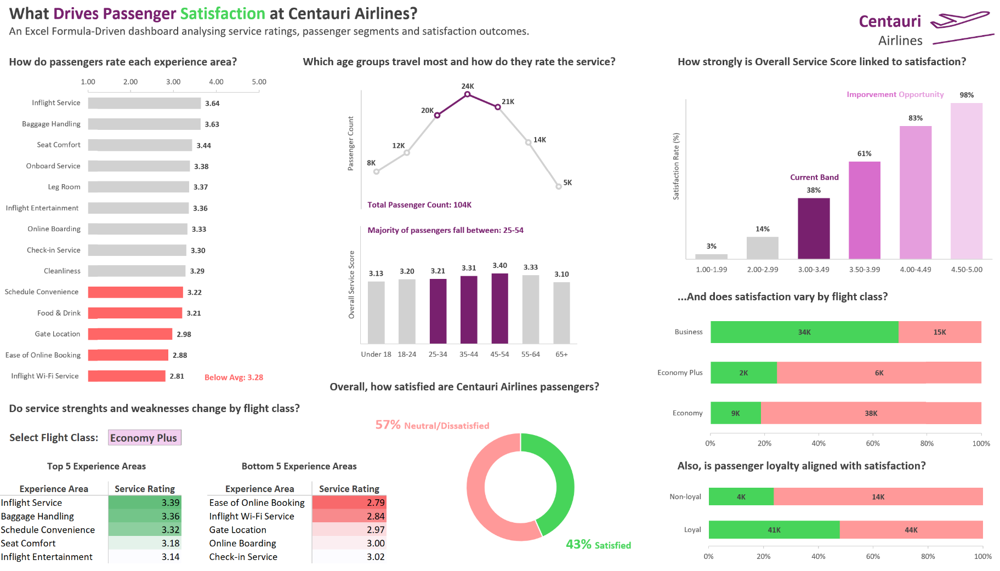

# Centauri Airlines Passenger Satisfaction Dashboard

## Project Overview

This project analyses airline passenger satisfaction data to understand how service ratings, passenger segments, flight class, and loyalty are associated with overall satisfaction.

The dashboard was built in **Microsoft Excel** using a formula-driven approach. It allows users to explore the data dynamically by selecting different flight classes: **All**, **Economy**, **Economy Plus**, and **Business**. Based on the selected flight class, the KPI cards, charts, and satisfaction analysis update automatically.

The aim of this project was to identify which passenger experience areas require improvement and how Overall Service Score is linked to passenger satisfaction.

---

## Business Question

**What drives passenger satisfaction at Centauri Airlines?**

Supporting questions explored in the dashboard:

* How do passengers rate each experience area?
* Which service areas perform above or below the selected class average?
* How do passenger volume and service scores vary by age group?
* How strongly is Overall Service Score linked to passenger satisfaction?
* How does satisfaction vary by passenger loyalty?
* How do satisfaction outcomes differ across flight classes?

---

## Tools Used

* Microsoft Excel
* Excel formulas
* Form controls
* Data validation / linked cell logic
* Conditional formatting
* Charts and dashboard design

---

## Excel Techniques Used

This project used a formula-driven dashboard design rather than PivotTables.

Key Excel techniques included:

* `AVERAGEIF` and `AVERAGEIFS`
* `COUNTIF` and `COUNTIFS`
* `SUMIF` and `SUMIFS`
* `IF` and `IFS`
* `SWITCH`
* `RANK.EQ`
* `XLOOKUP`
* `INDEX`
* Dynamic array functions including `SORT`, `UNIQUE`, and `TRANSPOSE`
* Helper columns
* Form control spin button
* Linked cell logic
* Dynamic KPI cards
* Dynamic chart ranges
* Dynamic below-average highlighting
* Age group segmentation
* Overall Service Score bands
* Satisfaction rate calculations
* 100% stacked bar charts
* Donut chart
* Bar charts
* Line and column charts
* Dashboard layout and visual storytelling

---

## Data Preparation and Assumptions

Several helper columns were created to support the dashboard and analysis:

* **Overall Service Score (OSS)**: calculated as the average rating across passenger experience areas, excluding `0` values.
* **Age Group**: passengers were grouped into age bands.
* **Overall Service Score Band**: passengers were grouped into OSS bands to compare satisfaction rates.
* **Satisfaction Rate**: calculated as the percentage of passengers marked as satisfied.
* **Class Selection Logic**: a form control was used to switch between All, Economy, Economy Plus, and Business views.
* **Dynamic Highlighting**: experience areas below the selected class OSS average were highlighted.

### Overall Service Score Calculation Example

Overall Service Score was calculated as the average rating across the passenger experience areas.

There are 14 passenger experience categories. If a passenger gives the following ratings:

`2, 4, 4, 2, 5, 1, 4, 0, 3, 3, 2, 3, 5, 3`

The value `0` is treated as **Not Rated / Not Applicable**, so it is excluded from the calculation.

* Sum of valid ratings = `41`
* Number of valid responses = `13`
* Overall Service Score = `41 / 13`
* Overall Service Score = `3.15`

Important assumptions:

* Rating values of `0` were treated as **Not Rated / Not Applicable** and excluded from average service rating calculations.
* The analysis focuses on association rather than causation.
* Flight haul was analysed during the project but was not included in the final dashboard because further analysis showed that flight class explained the satisfaction pattern more clearly.

---

## Dashboard Sections

### 1. Flight Class Selector

The dashboard includes a form control spin button that allows users to switch between:

* All passengers
* Economy
* Economy Plus
* Business

The KPI cards and charts update dynamically based on the selected flight class.

---

### 2. Service Ratings by Experience Area

This section shows the top-rated and lowest-rated passenger experience areas, along with the Overall Service Score for the selected flight class.

The bar chart dynamically updates based on the selected class and highlights experience areas that fall below the selected class average.

---

### 3. Passenger Profile and Overall Service Score

This section analyses passenger count and Overall Service Score by age group.

The dashboard highlights the largest passenger age groups to show where passenger volume is concentrated and whether service scores differ significantly across age groups.

---

### 4. Satisfaction Drivers and Outcomes

This section shows the overall satisfaction rate, current OSS band, and loyal passenger share for the selected flight class.

It also compares satisfaction rate across Overall Service Score bands to show how higher service scores are associated with higher satisfaction.

---

### 5. Passenger Loyalty and Satisfaction

A 100% stacked bar chart compares satisfaction outcomes between loyal and non-loyal passengers.

This helps assess whether passenger loyalty aligns with higher satisfaction and whether the airline’s existing loyal passenger base still has room for improvement.

---

## Key Insights

* Inflight Service and Baggage Handling were generally strong experience areas, while Inflight Wi-Fi Service and Online Booking were recurring weaker areas.
* Several experience areas fell below the selected class average, showing that Centauri Airlines should prioritise weaker controllable service areas.
* Overall Service Score was strongly associated with satisfaction. Passengers in higher OSS bands showed much higher satisfaction rates.
* Economy passengers had a much lower satisfaction rate than Business passengers, making Economy a key improvement area.
* Passenger volume was mainly concentrated in the 25–54 age range, while Overall Service Score remained relatively consistent across age groups.
* Loyal passengers were more satisfied than non-loyal passengers, but satisfaction among loyal passengers still remained below 50% in the overall view.
* Flight haul was initially analysed, but further investigation showed that higher satisfaction on longer-haul flights was largely influenced by a higher proportion of Business Class passengers.

---

## Recommendations

Centauri Airlines should prioritise improving controllable low-rated service areas such as **Inflight Wi-Fi Service**, **Online Booking**, and **Food & Drink**.

Improving these experience areas could help raise the Overall Service Score and move more passengers into higher satisfaction bands.

The airline should also pay close attention to **Economy passengers**, as they make up a large share of the passenger base but show much lower satisfaction than Business passengers.

Finally, although loyal passengers are more satisfied than non-loyal passengers, satisfaction among loyal passengers still leaves room for improvement. This suggests that Centauri Airlines should focus not only on customer retention, but also on improving the overall experience for existing loyal passengers.

---

## Dashboard Insights and Analysis

A separate one-page discussion of the dashboard findings, assumptions, and analysis decisions is available here:

[Read the Dashboard Insight and Analysis](dashboard-insight-analysis.md)

---

## Files Included

### `Centauri_Airlines_Passenger_Satisfaction_Dashboard.xlsx`

Excel workbook containing the dashboard, analysis, working data, helper columns, and supporting calculations.

### `images/dashboard-preview.png`

Dashboard preview image.

### `dashboard-insight-analysis.md`

One-page dashboard insight and analysis discussing the key findings, assumptions, and recommendations from the project.

---

## Project Status

Completed Project 1 of 5
